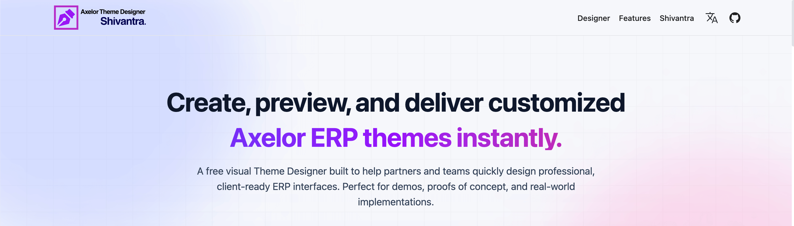
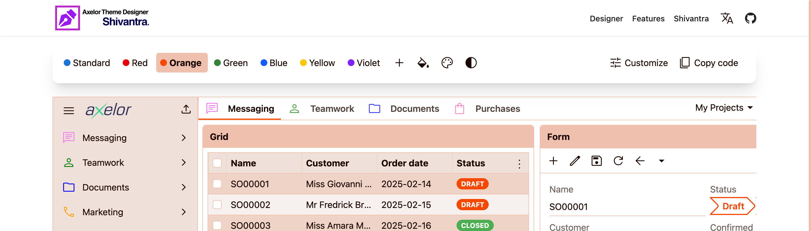
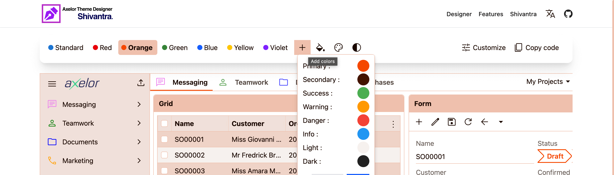
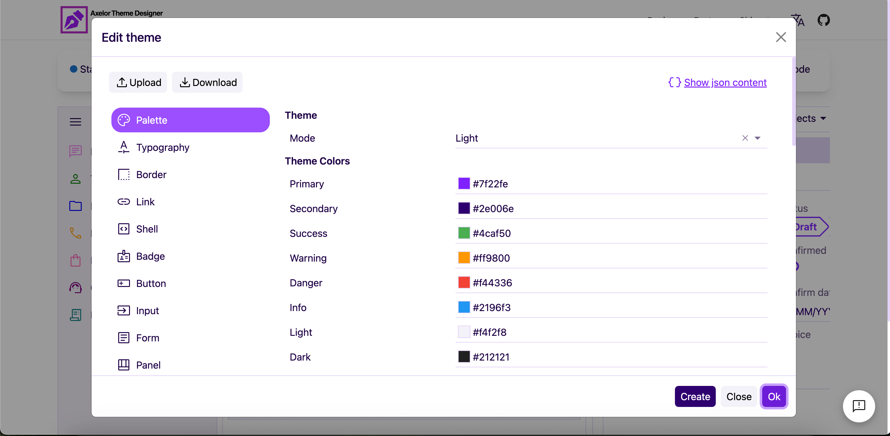

<h1 align="center">Shivantra Axelor Theme Designer</h1>

<p align="center">
  <a href="https://shivantra.com/axelor-theme-designer/">
    
  </a>
  <a href="https://github.com/shivantra/axelor-theme-designer/blob/main/LICENSE">
    
  </a>
  
  
</p>

---

## About Project

**Shivantra Axelor Theme Designer** is a modern tool for **customizing Axelor ERP themes**.  
A free visual Theme Designer built to help partners and teams quickly design professional, client-ready ERP interfaces. Perfect for demos, proofs of concept, and real-world implementations. 

---

## Features

- Pre-defined color themes  
- Custom theme creation with **live preview**  
- Multi-language support  
- Export theme JSON for Axelor ERP integration  
- Fully responsive design  
- Dark and Light mode support  
- Easily edit pre-defined colors  
- Copy theme to clipboard for configuration  

---

## Designer Page Steps

Follow these steps to use the designer page:

1. **Open Designer Page**  
   - Navigate to `/designer` or click **Designer** from the main menu.

   

2. **Select a Pre-defined Theme**  
   - Click the **Theme Pre-defined Color**  
   - Choose any theme from the list  
   - Preview updates in real-time

   

3. **Add Custom Theme**  
   - Click **+**  
   - Pick primary, secondary, success, warning, danger, info, light, and dark colors  
   - Preview instantly

   

4. **Export Theme**  
   - Export the theme JSON for integration with Axelor ERP

5. **Switch Languages**  
   - Use **Language Dropdown** on the top-right  
   - Test multi-language support

   

6. **Dark and Light Mode**  
   - Toggle between dark and light mode easily

   

7. **Edit Pre-defined Colors**  
   - Modify any pre-defined theme colors directly

   

8. **Customize Theme Options**  
   - Go to **Designer > Customize**  
   - Adjust theme options as needed

   

9. **Copy Theme**  
    - Copy theme configuration to clipboard  
    - Paste into theme editor or configuration file

    

---

## Tech Stack

| Category      | Technology |
|--------------|------------|
| Frontend     | React |
| Build Tool   | Vite |
| Language     | TypeScript |
| Styling      | Tailwind CSS |
| Routing      | React Router |
| State        | React Context / Hooks |

---

## Development

This application is scaffolded using **Vite** with the **TypeScript** template. You can clone the repository for custom development.

To run the application locally on your machine, follow the steps below:

## Using npm

```bash
git clone https://github.com/shivantra/axelor-theme-designer.git
cd shivantra-axelor-theme-designer
npm install
npm run dev
```

## Using yarn

```bash
git clone https://github.com/shivantra/axelor-theme-designer.git
cd shivantra-axelor-theme-designer
yarn install
yarn dev
```

## Using pnpm

```bash
git clone https://github.com/shivantra/axelor-theme-designer.git
cd shivantra-axelor-theme-designer
pnpm install
pnpm dev
```

## Privacy

This application uses **local storage** to persist your theme configurations directly in your browser.

The application uses **Google Analytics** to collect anonymous usage statistics in order to understand application usage and improve the overall user experience.